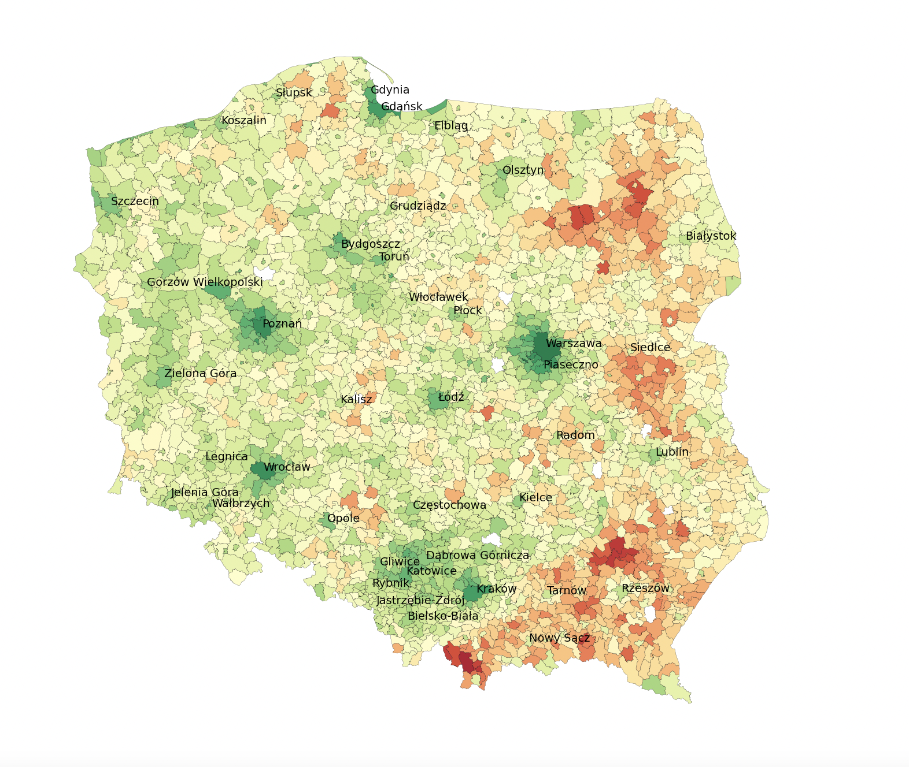

# Vaccines: data visualisation
Small project visualising current COVID-19 vaccination rate in Poland.



## Installation
Project uses poetry as dependency manager, command to run is:

```bash
poetry run vaccines
```

## Data sources
Polish counties shapefile comes from [gis support](https://gis-support.pl/baza-wiedzy-2/dane-do-pobrania/granice-administracyjne/)

Vaccination data comes from the government (https://www.gov.pl/api/data/covid-vaccination-contest)

## Planned tasks
- [x] Data gathering
- [x] Basic map plotting
- [x] Display names of larger cities for better map orientation
- [ ] Fix missing 10 municipalities data [more info](https://www.gov.pl/web/premier/10-nowych-miast-na-mapie-polski-premier-m-morawiecki-to-akt-sprawiedliwosci-dziejowej)
- [ ] Ensure that downloaded COVID-19 data is cached, instead of redownloading it
- [ ] Add other map options (vaccinatation rate per age group, single dose coverage etc.)
- [ ] Add interactivity


## Contributing
Pull requests are welcome. For major changes, please open an issue first to discuss what you would like to change.

## License
[MIT](https://choosealicense.com/licenses/mit/)